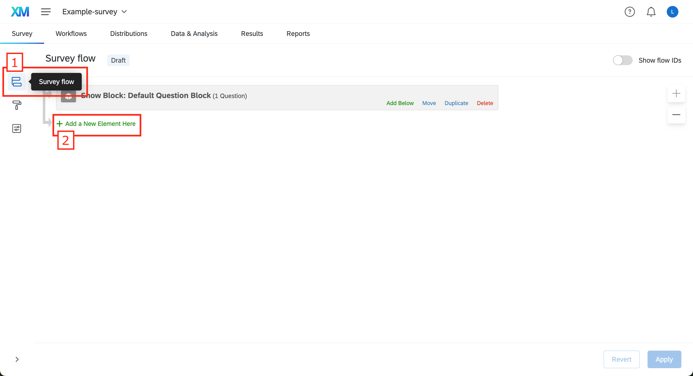
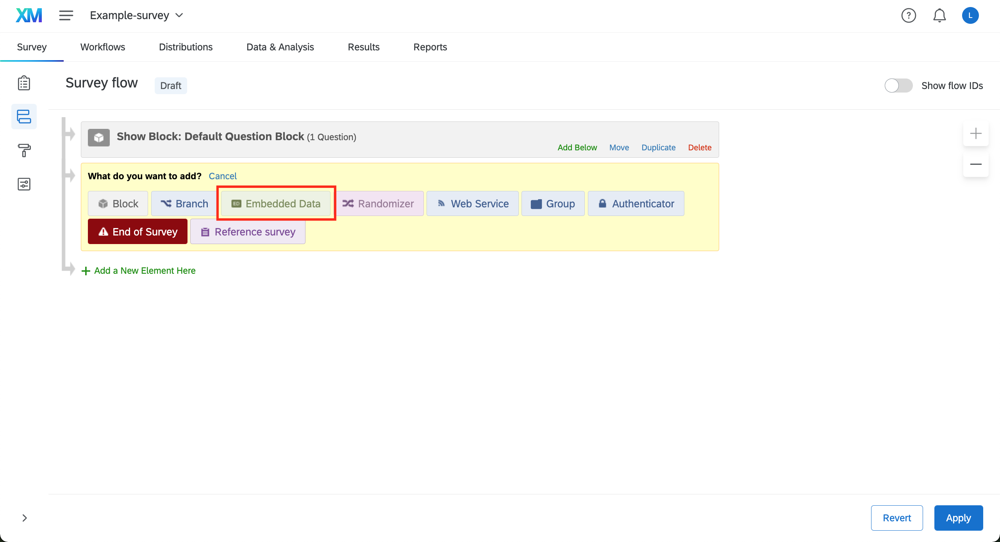
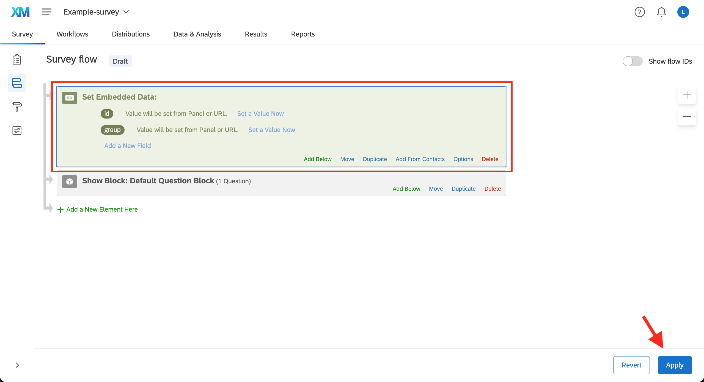
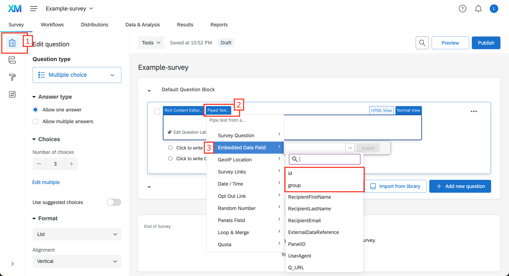
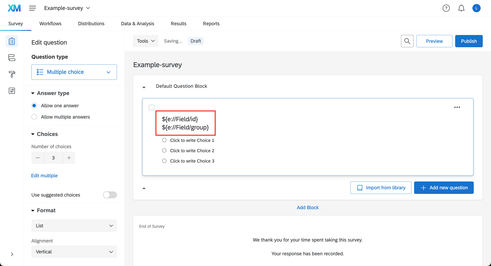
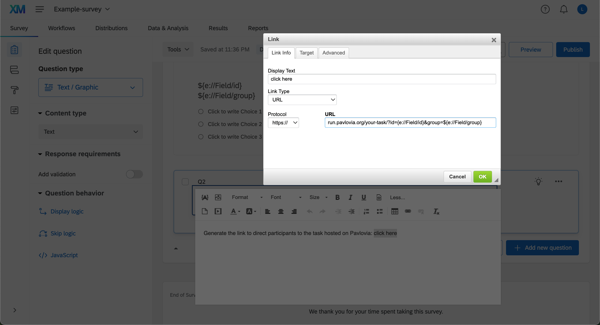
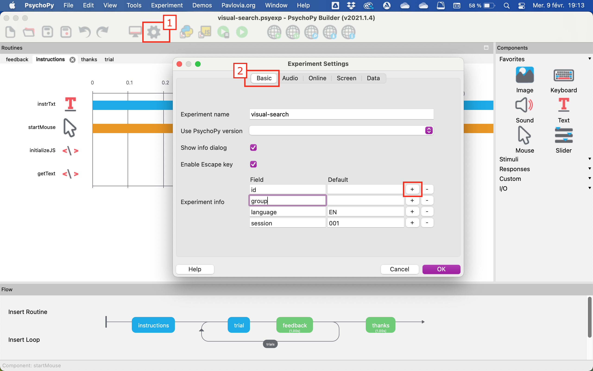

# Use query strings and embedded data

This documentation explains how to use query strings and embedded data in Qualtrics.

*Query strings are sets of parameters attached to the end of an URL, they are used to pass information to one website to another.*

Resources:
- [Qualtrics: Passing Information via Query Strings](https://www.qualtrics.com/support/survey-platform/survey-module/survey-flow/standard-elements/passing-information-through-query-strings/)
- [Qualtrics: Embedded Data](https://www.qualtrics.com/support/survey-platform/survey-module/survey-flow/standard-elements/embedded-data/)
- [Qualtrics: Piped Text](https://www.qualtrics.com/support/survey-platform/survey-module/editing-questions/piped-text/piped-text-overview/)

  
In this example, we are going to pass on information about participant ID and group to a Qualtrics survey and then to an online experiment hosted on Pavlovia.

## Append query strings to the Qualtrics URL

Copy the link to your Qualtrics survey. For example:
`https://survey.qualtrics.com/jfe/form/SV_123456789`

Add **?** to start the query string:
`https://survey.qualtrics.com/jfe/form/SV_123456789?`

Add the field name **id** followed by **=**:
`https://survey.qualtrics.com/jfe/form/SV_123456789?id=`

Add the value of the field (here participant ID is **pp01**):
`https://survey.qualtrics.com/jfe/form/SV_123456789?id=pp01`

To add additional fields, repeat the same process but use **&** instead of **?** (here **group** is **2**):
`https://survey.qualtrics.com/jfe/form/SV_123456789?id=pp01&group=2`

## Extract the information from the URL and save as embedded data

In your Qualtrics survey, go to **Survey flow**

Click on **Add a New Element Here > Embedded Data**

Add your field names exactly as you wrote them in your query string (here `id` and `group`). Do not set a value, leave as "Value will be set from Panel or URL"

Move the embedded data element to the very top of the survey flow and **Apply** the changes

## Use piped text to access information inside embedded data

In your Qualtrics survey, go to the **Builder**

Create a question, click on **Piped Text**, **Embedded Data Field** and insert the ones you just created

In this case we have `${e://Field/id}` and `${e://Field/group}`

## Generate an URL with query strings to go to Pavlovia

Copy the link to your Pavlovia task. For example:
`https://run.pavlovia.org/your-task/`

Add **?** to start the query string, add the field name **id** followed by **=**:
`https://run.pavlovia.org/your-task/?id=`

Add the piped text corresponding to the field "id" (**\${e://Field/id}**):
`https://run.pavlovia.org/your-task/?id=${e://Field/id}`

Add **&** and do the same for the field "group":
`https://run.pavlovia.org/your-task/?id=${e://Field/id}&group=${e://Field/group}`

*Optional: Transform into a hyperlink* [[details here]](https://www.qualtrics.com/support/survey-platform/survey-module/editing-questions/rich-content-editor/insert-a-hyperlink/)

## Make sure the experiment on Pavlovia can get the information from the query string

Open your experiment in the PsychoPy Builder, go to **Experiment Settings** (gear wheel icon), tab **Basic** and add the fields `id` and `group` to the **Experiment info**

Save the experiment, export to HTML and make it active on Pavlovia if necessary

## Do a test

1. Access Qualtrics survey using the URL with query string: `https://survey.qualtrics.com/jfe/form/SV_123456789?id=pp01&group=2`
2. Click on the link to go to the online Pavlovia experiment
3. If set properly, you should see the participant ID and the group appended at the end of the URL (here `https://run.pavlovia.org/your-task/?id=pp01&group=2`)

4. Try to change the field values of **id** and **group** in the initial Qualtrics URL (e.g., `https://survey.qualtrics.com/jfe/form/SV_123456789?id=participant123&group=456`) and see what happens to the URL directing to Pavlovia
