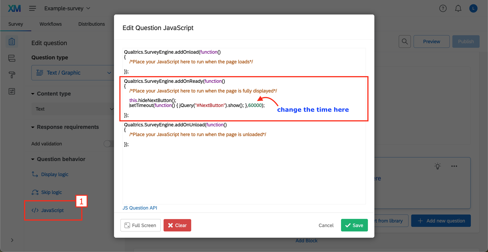

# Next and back buttons in Qualtrics

## Hide the "Next" button during a set amount of time

- Compute how long you want to hide the "Next" button for in ms (here 1 minute = 60 000 ms)
- Add JavaScript to the question
- After `/*Place your JavaScript here to run when the page is fully displayed*/` copy and paste this code:

```js
this.hideNextButton();
setTimeout(function() { jQuery("#NextButton").show(); },60000);
```

- Click **Save**




## Enable "Back" button in the survey

- Go to **Survey options > Responses**
- Turn Back button **on**


