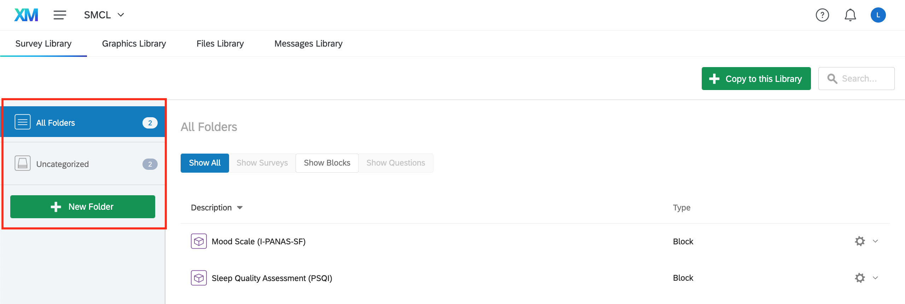

# Use Qualtrics libraries

This documentation explains how to use Qualtrics libraries.

Resources:
- [Qualtrics: Library Basic Overview](https://www.qualtrics.com/support/survey-platform/account-library/library-overview/)
- [Qualtrics: Survey Library](https://www.qualtrics.com/support/survey-platform/account-library/survey-library/)
- [Qualtrics: Messages Library](https://www.qualtrics.com/support/survey-platform/account-library/message-library/)


## Access your Library page

Go to your Library page


Select your library (this can be your personal library or a group library)


You can organize elements of your library using different folders




## Survey Library

In this library you can store surveys, blocks of questions or individual questions.


### Copy to Library

Method 1: Go to **Survey Library** and click on **Copy to this Library**. Select the type of element you want to copy (entire survey, blocks of questions or individual questions). Select an existing survey as a source, a source block or source question if applicable. Select a destination folder and enter a name. [[more details here]](https://www.qualtrics.com/support/survey-platform/account-library/survey-library/#CopyingToTheLibrary)


Method 2: Go to your survey **Builder** and click the block options menu (`...` on the top right of the block). Select **Copy block to library** or **Copy questions to library**. Select a library, a folder and add description. [[more details here]](https://www.qualtrics.com/support/survey-platform/account-library/survey-library/#CopyingBlocksFromSurvey)


### Import from Library

In the survey **Builder** and click **Import from library** at the bottom of a block. Select a library of your choice, select the block or questions you want to copy. [[more details here]](https://www.qualtrics.com/support/survey-platform/account-library/survey-library/#UsingABlockOrQuestionFromTheLibrary)


## Messages Library

In this library you can store various types of messages: error messages, email invites, email subjects, etc...


### Add to Library

Go to **Messages Library** and click on **New Message**. Select the message type, the destination folder, add a description and type in your message. [[more details here]](https://www.qualtrics.com/support/survey-platform/account-library/message-library/#CreatingAMessageInALibrary)


## *Example:* make library messages to send out a link to a survey after signing up


### 1. Subject Line

Add a new message as shown above. Select **Email Subject Messages** as *Message Type*. Choose a destination folder, add a description and type in your email subject. If using another language, click on **Translate Message**.


Select a language using the dropdown on the right panel. Translate your message and exit by clicking on **Return to Messages Library**. [[more details here]](https://www.qualtrics.com/support/survey-platform/account-library/message-library/#TranslatingMessages)


### 2. Main Message

Add a new message as shown above. Select **Invite Emails** as *Message Type*. Choose a destination folder, add a description and type in your email message.
Use piped text (**`{A}` > Survey Links**) to insert custom survey link, survey URL and opt out link to your message. If using another language, click on **Translate Message**.


Example of a Invite Email with piped text for survey links:

```
Thank you for signing up to participate in our study!

You can access the online survey ${l://SurveyLink?d=by%20clicking%20here}.

Or copy and paste the URL below into your internet browser:
${l://SurveyURL}

Follow this link to opt out of future emails:
${l://OptOutLink?d=Click%20here%20to%20unsubscribe}

The Sensorimotor Control Lab
```


