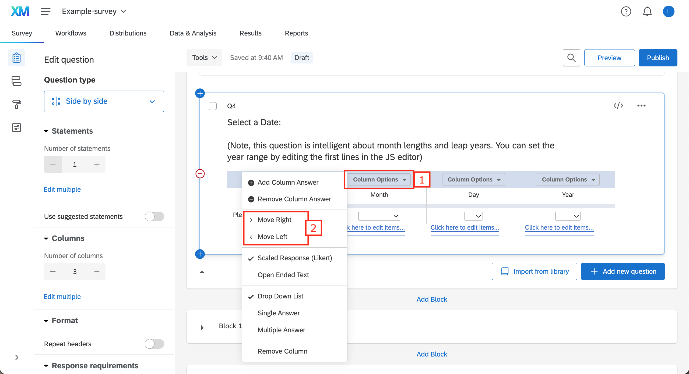
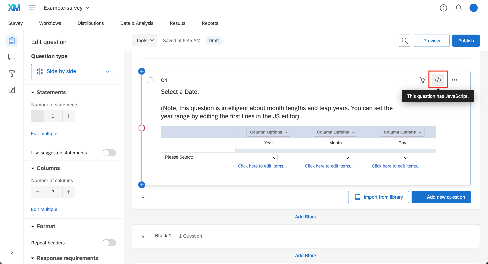

# Add date selection questions

This documentation explains how to add date selection questions in Qualtrics. These questions will be intelligent about month lengths and leap years.

Resources:
- [Qualtrics XM Community: Calendar/Date Picker](https://community.qualtrics.com/XMcommunity/discussion/101/calendar-date-picker)


## Method 1: From the Qualtrics Library

### Insert the default question

In the survey builder, click on **Import from library**


Search for **date** and select **Calendar & Date Questions** under the Qualtrics Library section


Select the **Side by Side** question and **Insert question**


Rearrange the order of each column (**Column Options > Move Right or Move Left**) to have the year first, then the month and finally the day



<br />*By default you can select a date between 1900 and 2049 but in this example we will see how to select dates between 2019 and the current year.*

### Modify the default question

Click `</>` to open the JS editor



Modify the very first lines, as indicated within the code

JS code **before**:
``` js
//Set years you would like to have available
var yearFirst = 1900; //Min 1900
var yearLast = 2049; //Max 2049
```


JS code **after**:
``` js
//Set years you would like to have available
var d = new Date(); //Get today's date
var yearFirst = 2019; //Min is 2019
var yearLast = d.getFullYear(); //Max is current year
```


<br />Now when participants answer this question, the minimum year is set to 2019 and the maximum year corresponds to the current year.

*As you can see, the default date selection question has a long list of year which can be tricky to work with. It is also possible to create your own question using fewer options for year.*


## Method 2: Create your own date selection question

In this example, we will create a question asking participants which COVID vaccine they got and when.

Create a side by side question


Add 4 statements (rows) for Dose 1, 2 , 3, and 4


Add 4 columns for the vaccine, the year, the month and the day


For each column, add as many column answers as needed (**Column Options > Add Column Answer**) and rename them:

- Vaccine: Add vaccines A, B, C
- Year: Add years 2019 to 2025 (you can only make the initial list longer and then hide options)
- Month: Add 12 months
- Day: Add 31 days


If you get an error message, click OK


For each column, select the drop down list option (**Column Options > Drop Down List**)


Right now the question is not intelligent about month lengths and leap years. Moreover, all the year choice options are displayed. Add JavaScript to the question


Copy and paste the following code:
**/!\ On the first line: Don't forget to match the variable `firstYearoption` to the first choice option you have for 'Year'.**

``` js
/* ---------------------- Set common parameters ---------------------- */

var firstYearoption = 2019; //Put your first 'Year' choice option here
var d = new Date(); //Get today's date
var yearLast = d.getFullYear(); //Max


/* ---------------------- 1st row ---------------------- */

Qualtrics.SurveyEngine.addOnload(function()
{
	var qid=this.questionId;
	var yr=document.getElementsByName('QR~'+qid+'#2~1')[0];
	var mo=document.getElementsByName('QR~'+qid+'#3~1')[0];
	var day=document.getElementsByName('QR~'+qid+'#4~1')[0];

	//Remove years after yearLast
	var j = yearLast-(firstYearoption-2);
	for(i=j;i<151;i++){
		yr.remove(j);
	}

	function fixer()
  {
    day.options[29].disabled=0;
    day.options[30].disabled=0;
    day.options[31].disabled=0;
    if(mo.selectedIndex==2||mo.selectedIndex==4||mo.selectedIndex==6||mo.selectedIndex==9||mo.selectedIndex==11)
    {
      day.options[31].disabled=1;
      if(day.selectedIndex==31){day.selectedIndex=30};
      if(mo.selectedIndex==2)
      {
        day.options[30].disabled=1;
        if(day.selectedIndex==30){day.selectedIndex=29};
        if(parseInt(yr.options[yr.selectedIndex].innerHTML,10)%4!=0)
        {
          day.options[29].disabled=1;
          if(day.selectedIndex==29){day.selectedIndex=28};
        }
        else
        {
          day.options[29].disabled=0;
        }
      }
    }

  }

	yr.onchange=function(){fixer();};
	mo.onchange=function(){fixer();};

});

/* ---------------------- 2nd row ---------------------- */

Qualtrics.SurveyEngine.addOnload(function()
{
	var qid=this.questionId;
	var yr=document.getElementsByName('QR~'+qid+'#2~2')[0];
	var mo=document.getElementsByName('QR~'+qid+'#3~2')[0];
	var day=document.getElementsByName('QR~'+qid+'#4~2')[0];

	//Remove years after yearLast
	var j = yearLast-(firstYearoption-2);
	for(i=j;i<151;i++){
		yr.remove(j);
	}

	function fixer()
  {
    day.options[29].disabled=0;
    day.options[30].disabled=0;
    day.options[31].disabled=0;
    if(mo.selectedIndex==2||mo.selectedIndex==4||mo.selectedIndex==6||mo.selectedIndex==9||mo.selectedIndex==11)
    {
      day.options[31].disabled=1;
      if(day.selectedIndex==31){day.selectedIndex=30};
      if(mo.selectedIndex==2)
      {
        day.options[30].disabled=1;
        if(day.selectedIndex==30){day.selectedIndex=29};
        if(parseInt(yr.options[yr.selectedIndex].innerHTML,10)%4!=0)
        {
          day.options[29].disabled=1;
          if(day.selectedIndex==29){day.selectedIndex=28};
        }
        else
        {
          day.options[29].disabled=0;
        }
      }
    }

  }

	yr.onchange=function(){fixer();};
	mo.onchange=function(){fixer();};

});

/* ---------------------- 3rd row ---------------------- */

Qualtrics.SurveyEngine.addOnload(function()
{
	var qid=this.questionId;
	var yr=document.getElementsByName('QR~'+qid+'#2~3')[0];
	var mo=document.getElementsByName('QR~'+qid+'#3~3')[0];
	var day=document.getElementsByName('QR~'+qid+'#4~3')[0];

	//Remove years after yearLast
	var j = yearLast-(firstYearoption-2);
	for(i=j;i<151;i++){
		yr.remove(j);
	}

	function fixer()
  {
    day.options[29].disabled=0;
    day.options[30].disabled=0;
    day.options[31].disabled=0;
    if(mo.selectedIndex==2||mo.selectedIndex==4||mo.selectedIndex==6||mo.selectedIndex==9||mo.selectedIndex==11)
    {
      day.options[31].disabled=1;
      if(day.selectedIndex==31){day.selectedIndex=30};
      if(mo.selectedIndex==2)
      {
        day.options[30].disabled=1;
        if(day.selectedIndex==30){day.selectedIndex=29};
        if(parseInt(yr.options[yr.selectedIndex].innerHTML,10)%4!=0)
        {
          day.options[29].disabled=1;
          if(day.selectedIndex==29){day.selectedIndex=28};
        }
        else
        {
          day.options[29].disabled=0;
        }
      }
    }

  }

	yr.onchange=function(){fixer();};
	mo.onchange=function(){fixer();};

});

/* ---------------------- 4th row ---------------------- */

Qualtrics.SurveyEngine.addOnload(function()
{
	var qid=this.questionId;
	var yr=document.getElementsByName('QR~'+qid+'#2~4')[0];
	var mo=document.getElementsByName('QR~'+qid+'#3~4')[0];
	var day=document.getElementsByName('QR~'+qid+'#4~4')[0];

	//Remove years after yearLast
	var j = yearLast-(firstYearoption-2);
	for(i=j;i<151;i++){
		yr.remove(j);
	}

	function fixer()
  {
    day.options[29].disabled=0;
    day.options[30].disabled=0;
    day.options[31].disabled=0;
    if(mo.selectedIndex==2||mo.selectedIndex==4||mo.selectedIndex==6||mo.selectedIndex==9||mo.selectedIndex==11)
    {
      day.options[31].disabled=1;
      if(day.selectedIndex==31){day.selectedIndex=30};
      if(mo.selectedIndex==2)
      {
        day.options[30].disabled=1;
        if(day.selectedIndex==30){day.selectedIndex=29};
        if(parseInt(yr.options[yr.selectedIndex].innerHTML,10)%4!=0)
        {
          day.options[29].disabled=1;
          if(day.selectedIndex==29){day.selectedIndex=28};
        }
        else
        {
          day.options[29].disabled=0;
        }
      }
    }

  }

	yr.onchange=function(){fixer();};
	mo.onchange=function(){fixer();};

});
```
