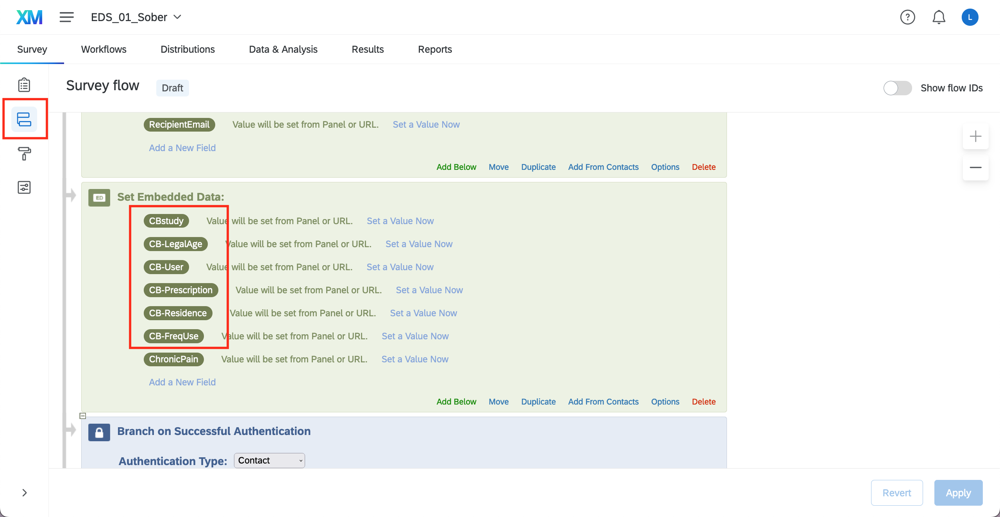
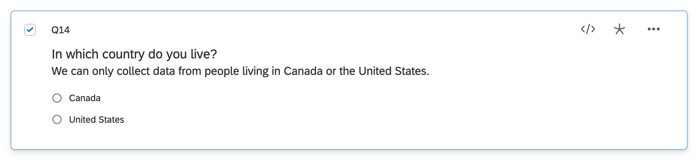
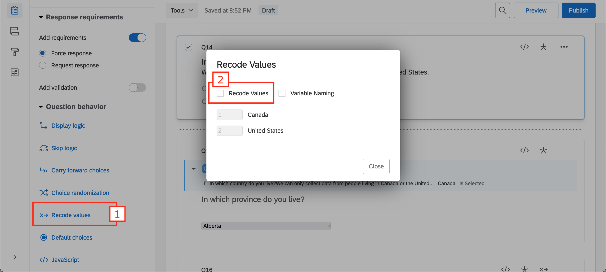
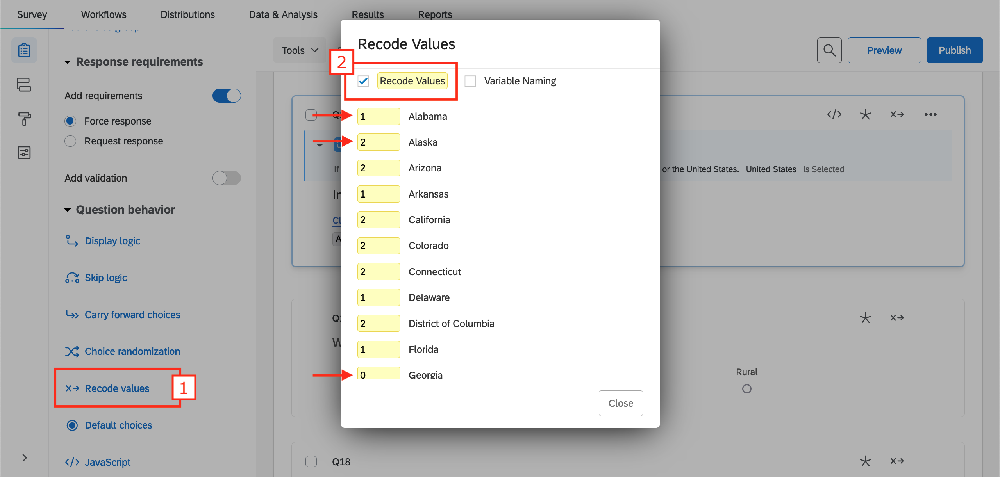
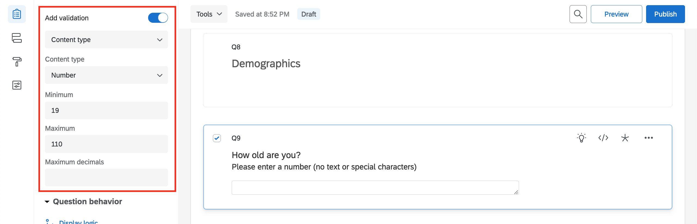
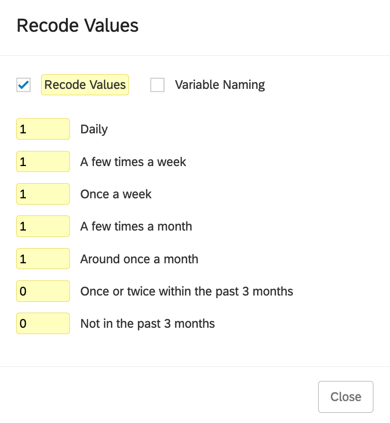

# Compute a score and set as embedded data

This documentation explains how to compute a score based on multiple questions and set as embedded data in Qualtrics using JavaScript.

In this example, we want to determine the eligibility of respondents to participate in a study investigating the immediate effects of cannabis use. To do so, we will take into account 5 parameters to compute a global score `CBstudy`:
- The respondent's country of residence `CB-Residence`
- Whether they are of legal age to use cannabis `CB-LegalAge`
- Whether they already use cannabis `CB-User`
- How often they use cannabis `CB-FreqUse`
- If they have a medical prescription `CB-Prescription`


## 1. Set embedded data in the survey flow

Add all the embedded data elements to your survey flow [[details here]](https://www.qualtrics.com/support/survey-platform/survey-module/survey-flow/standard-elements/embedded-data/#SettingValuesInTheSurveyFlow)




## 2. CB-Residence

`CB-Residence` takes into account the country and the state/district/province and is:
- 0 where cannabis use is illegal
- 1 where cannabis use is medical only
- 2 where cannabis is legalized

### Country

In this example, we only collect data from respondents living in Canada or the United States.

Add a 2 choice question asking in which country respondents live.



Make sure the recode values are 1 for Canada and 2 for the United States. If not, tick the **Recode Value** box and change the values.



### State/district/province

#### Canada

If Canada is selected, display a list of all the provinces. Cannabis use is legal everywhere in Canada so we will assign 2 to `CB-Residence` irrespective of the answer.

Add JavaScript to the question, then copy and paste the following code:

``` js
Qualtrics.SurveyEngine.addOnPageSubmit(function()
{

    Qualtrics.SurveyEngine.setEmbeddedData("CB-Residence", 2);

});
```

#### United States

If United States is selected, display a list of all the states and districts. **Recode values** of each possible choice:
- 0 for states/districts where cannabis use is illegal
- 1 for states/districts where only medical cannabis use is legal
- 2 for states/districts where cannabis use is legal



Add JavaScript to the question, then copy and paste the following code:

``` js
Qualtrics.SurveyEngine.addOnPageSubmit(function()
{

	var SelectedState = Number(this.getChoiceRecodeValue(this.getSelectedChoices()));

	Qualtrics.SurveyEngine.setEmbeddedData("CB-Residence", SelectedState);

});
```


## 3. CB-LegalAge

`CB-LegalAge` is determined by the country of residence and is:
- 0 for respondents under legal age to use cannabis
  - Younger than 19 in Canada
  - Younger than 21 in the United States
- 1 for respondents of legal age to use cannabis
  - 19 and older in Canada
  - 21 and older in the United States

### Age

Add a text entry question asking how old participants are. Make sure to **Add validation > Content type > Number**.



Add JavaScript to the question, then copy and paste the following code:

``` js
Qualtrics.SurveyEngine.addOnReady(function()
{
	/*Place your JavaScript here to run when the page is fully displayed*/

	/*Set embedded data Age*/
	jQuery("#"+this.questionId+" .InputText").on('blur',function(){
		Qualtrics.SurveyEngine.setEmbeddedData('CB-LegalAge', jQuery(this).val());
	});

});
```

### Country

Go back to the question asking where respondents live. Add JavaScript, then copy and paste the following code:

``` js
Qualtrics.SurveyEngine.addOnPageSubmit(function()
{

    var SelectedCountry = this.getSelectedChoices();

	var Age = Qualtrics.SurveyEngine.getEmbeddedData("CB-LegalAge");
	var CBAge;

	if (Age >= 19 && SelectedCountry == 1) {CBAge = 1}
	else if (Age < 19 && SelectedCountry == 1) {CBAge = 0}
	else if (Age >= 21 && SelectedCountry == 2) {CBAge = 1}
	else if (Age < 21 && SelectedCountry == 2) {CBAge = 0}
	else {CBAge = 0}

    Qualtrics.SurveyEngine.setEmbeddedData("CB-LegalAge", CBAge);

});
```


## 5. CB-User

`CB-User` is:
- 0 if the respondent never used cannabis
- 1 if the respondent has used cannabis before

Add a 2 choice question asking they ever used cannabis and **Recode values** as 0 for 'No' and 1 for 'Yes'.


## 5. CB-FreqUse

In this example, only those who use cannabis at least once a month will be eligible to participate.

`CB-FreqUse` is:
- 0 if the respondent uses less than once a month
- 1 if the respondent uses at least once a month

Add a multiple choice question asking how often they use cannabis and **Recode values** accordingly.




## 6. CB-Prescription

`CB-Prescription` is:
- 0 if the respondent does not have a medical prescription for cannabis
- 1 if the respondent has a medical prescription for cannabis

Add a 2 choice question asking they have a medical prescription for cannabis and **Recode values** as 0 for 'No' and 1 for 'Yes'.


## 7. CBstudy

`CBstudy` is a global score that takes into account all previous embedded data fields and it ranges from 0 to 3:
- if `CBstudy` < 2, the respondent is **not eligible** for the cannabis study
- if `CBstudy` ≥ 2, the respondent is **eligible** for the cannabis study

The formula to calculate `CBstudy` is:
CBstudy = (CB-Residence + CB-Prescription) * CB-LegalAge * CB-User * CB-FreqUse

In a question (has to be after all the embedded data we used), add JavaScript, then copy and paste the following code:

``` js
Qualtrics.SurveyEngine.addOnload(function()
{
	/*Place your JavaScript here to run when the page loads*/

    const CBAge = Number(Qualtrics.SurveyEngine.getEmbeddedData("CB-LegalAge"));
	const CBRes = Number(Qualtrics.SurveyEngine.getEmbeddedData("CB-Residence"));
	const CBUser = Number(Qualtrics.SurveyEngine.getEmbeddedData("CB-User"));
	const CBPrescr = Number(Qualtrics.SurveyEngine.getEmbeddedData("CB-Prescription"));
	const CBFreqUse = Number(Qualtrics.SurveyEngine.getEmbeddedData("CB-FreqUse"));

	var CBeligible = (CBRes + CBPrescr) * CBAge * CBUser * CBFreqUse;

	Qualtrics.SurveyEngine.setEmbeddedData("CBstudy", CBeligible);

});
```
